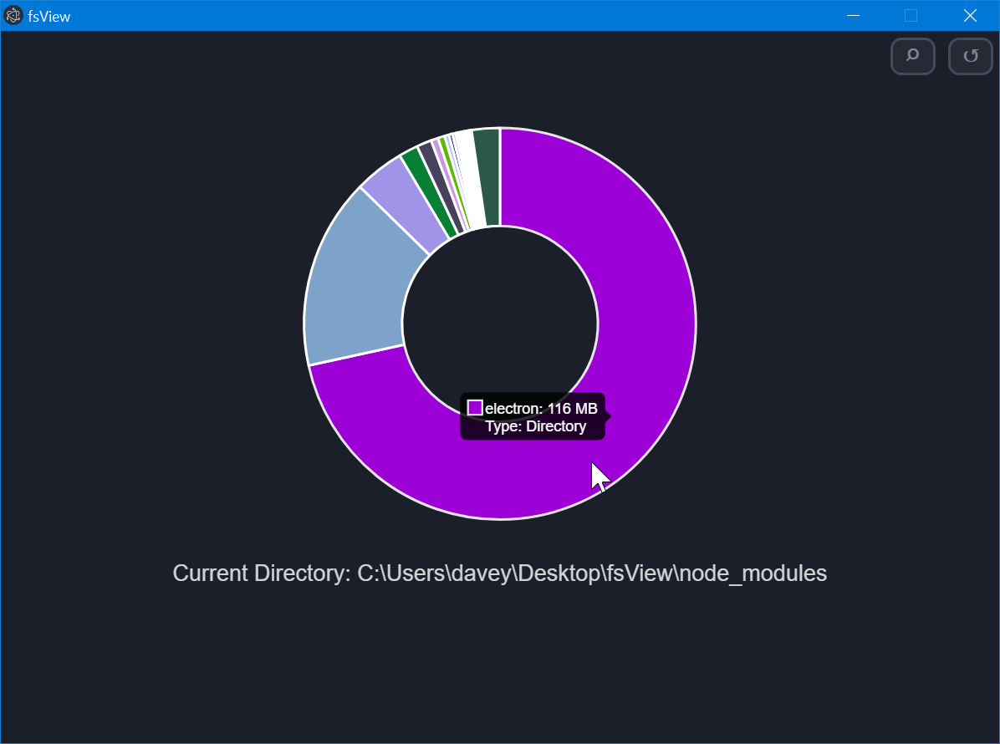
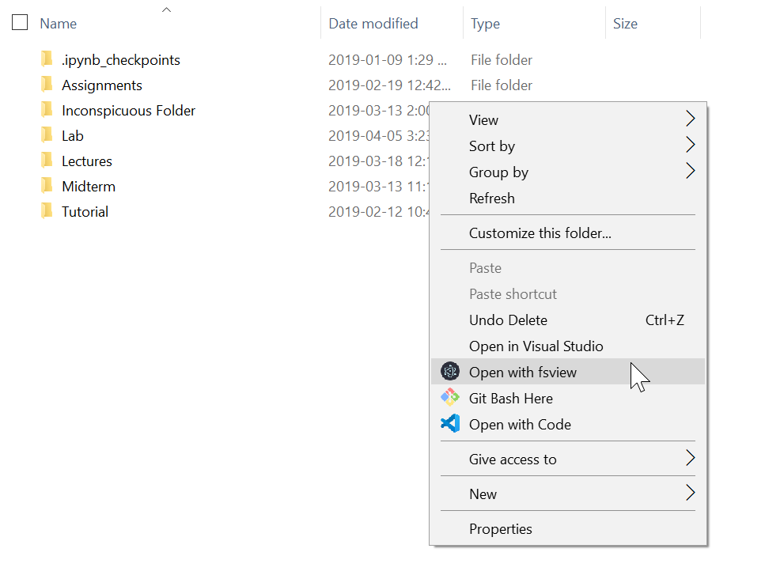

# fsView

A file system explorer that allows users to navigate directories and view how their space is allocated graphically.



## Running fsView
If you've installed fsView locally on windows, simply open fsView at a chosen root directory and fsView will begin to create a map of the files and folders beneath that root.



If you've simply cloned the repository, you will need to run 
```
$ npm start
```
within the root of the fsView directory in order to open fsView there. You can then navigate to a new directory by clicking the magnifying glass button.


## Features

fsView allows you to traverse the file directory it has opened. You can view the sizes of files and folders by simply hovering over them, and you can step into directories by clicking on their chart segment. You can step back out by clicking on the back button in the top right. Finally, you can open a new directory with the magnifying glass button adjacent to the back button.

## Creating an installer

To install fsView, first clone this repository and run 
```
$ npm init
```

Next, you will need to package the project with electron-packager (included in dev dependencies)
```
$ electron-packager ./
```
Finally, run 
```
$ node installers/windows/createinstaller.js
```

Your installer should now be ready at `fsView/installer/fsViewSetup.exe`

